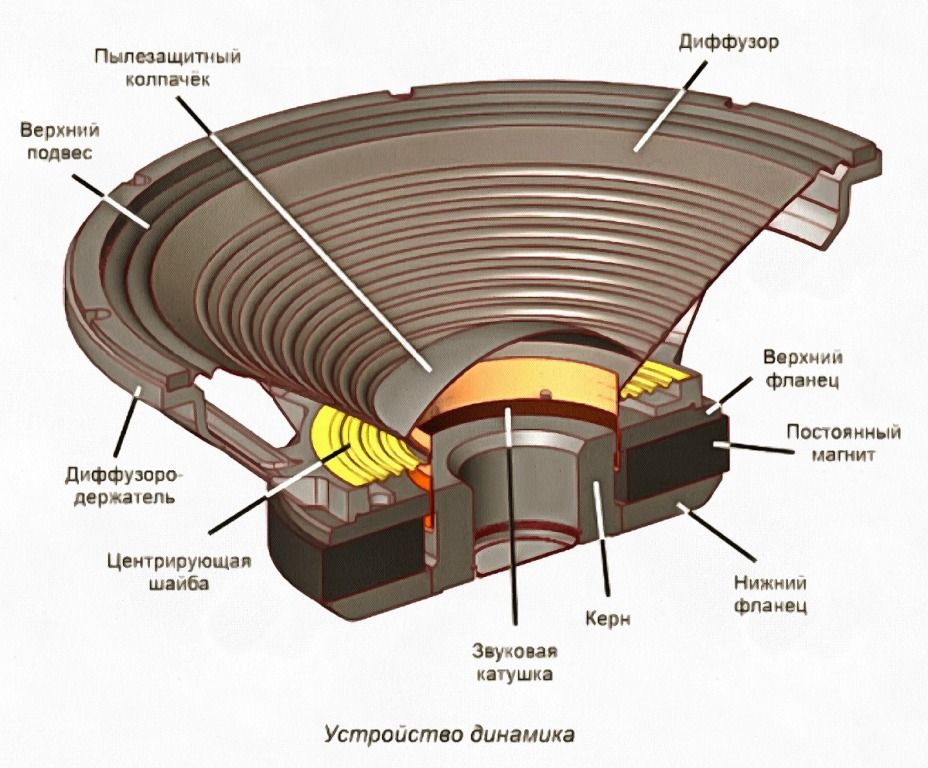

# модель динамика

Этот проект представляет собой интерактивное веб-приложение для моделирования работы и визуализации физических процессов в электродинамическом громкоговорителе. Приложение создано с использованием Streamlit.

## Функционал

-   **Интерактивные параметры**: Возможность изменять параметры входного аудиосигнала с помощью ползунков:
    -   Амплитуда напряжения (U, Вольт)
    -   Частота сигнала (f, Герц)
-   **Аудио-визуализация**:
    1.  **Воспроизведение звука**: Генерация и воспроизведение звукового тона, соответствующего заданным параметрам.
    2.  **Графики процессов**: Отображение зависимостей напряжения, тока в катушке и смещения диффузора от времени.

## Принцип работы

1.  **Входной сигнал**: Переменный электрический ток (моделируемый как синусоидальное напряжение) от усилителя подается на звуковую катушку.
2.  **Звуковая катушка**: Катушка, жестко соединенная с диффузором, находится в радиальном магнитном поле, создаваемом постоянным магнитом.
3.  **Взаимодействие полей**: Протекающий по катушке ток создает собственное переменное магнитное поле. Взаимодействие этого поля с полем постоянного магнита порождает **силу Ампера**.
4.  **Движение диффузора**: Сила Ампера заставляет катушку и связанный с ней диффузор колебаться вперед и назад в соответствии с формой входного сигнала.
5.  **Создание звука**: Колебания диффузора создают в окружающем воздухе волны сжатия и разрежения, которые мы воспринимаем как звук.

## Запуск приложения
streamlit run main.py
